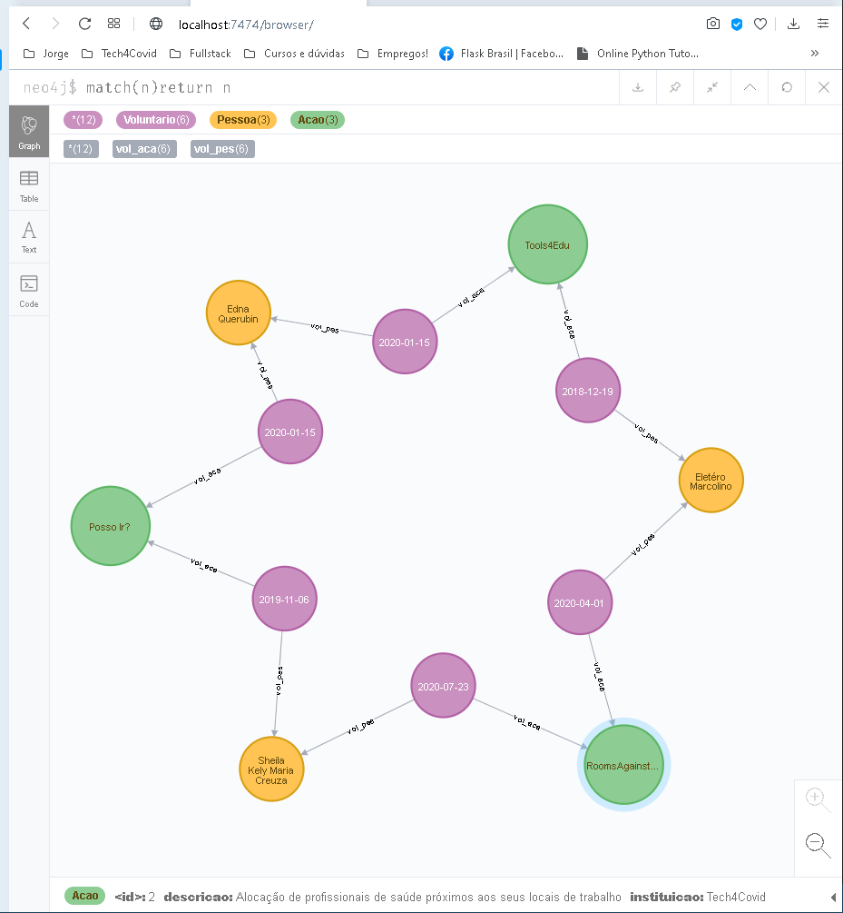

# Desafio ATADOS

##### Autor: `Júlio Cascalles`


---
### Conteúdo
O projeto _Atados_ é um teste que visa demonstrar funções básicas de um back-end Python para voluntários em ações sociais.

Recursos:
* Documentação Swagger automática*;
* Flask Restful;
* MVC** com Marshmallow e SqlAlchemy;
* DAO para banco de dados em Grafos "Neo4J";
* Testes unitários com Pytest.


### Endpoints
Supondo que você esteja rodando esta API **localmente**, as seguintes rotas estarão disponíveis:
    
* `/docs` Traz a documentação _Swagger_ com todos os verbos REST disponíveis para a API e exemplos funcionais (Os verbos REST podem ser usados diretamente no browser, ou com algum programa como _POSTMAN_...)


* `/Sales/Customer` Pode ser usado para trazer vários clientes (onde você pode passar uma query com os nomes dos campos, p.ex.: `...?name=CUSTOMERXYZ`)
    * você pode também passar um `.../<customer_id>`
    para operações que exigem um registro único (consulta por campo chave ou exclusão)
    * Em caso de **POST** ou **PUT** é preciso passar o JSON adequado no _body_ da requisição (o formato do JSON estará na documentação Swagger).

* `/Sales/Product` Funciona igual _/Sales/Customer_ só que para **Produtos**.

* `/Sales/Order` Funciona igual _/Sales/Customer_ só que para **Pedidos**.

* `/Sales/Item` Funciona igual _/Sales/Customer_ só que para **Itens de pedido**.

---

### Configuração de banco de dados
> Como exemplo, estou usando um DAO, feito totalmente por mim, para o banco de dados em grafos **Neo4J**.

Esta API foi testada por mim para usar qualquer um dos bancos de dados abaixo:
* Neo4J (o atual);
* MongoDB;
* AWS DynamoDB 
* MySQL;
* Sql Server;
* PostgreSQL;

---
### Testes unitários
As seguintes situações foram testadas para verificar se cada serviço está funcionando conforme esperado:

* Falha na busca: Deve retornar _"Not found"_ quando não encontra o registro
    * Não usei status 404 porque isso resulta em erro para vários SPA como React e Angular;
* Sucesso na busca: Retorna o registro relacionado ao campo chave usado na busca;
* Falha de inclusão: Não permite registro com campos inválidos;
* Sucesso na inclusão: Simula a gravação de um registro e retorna sem erros;

---
### Dados gerados

Os dados abaixo são resultado dos testes com a API.
A gravação dos registros pode ocorrer de várias formas:
* Gravar um Cliente, gravar um Produto e então Gravar um Pedido;
* Gravar um Pedido com um Cliente dentro e depois grava os itens desse pedido;
* Gravar tudo num único JSON representando todos os relacionamentos:

```
{
  "item_id": 2,
  "order": {
    "customer": {
      "customer_id": 1,
      "name": "Eleotereo Marcolino Saraiva"
    },
    "order_id": 1,
    "sale_date": "2020-07-04"
  },
  "product": {
    "name": "Queijo Estepe Tirolez",
    "product_id": 3,
    "value": 39.74
  },
  "quantity": 2
}
```

